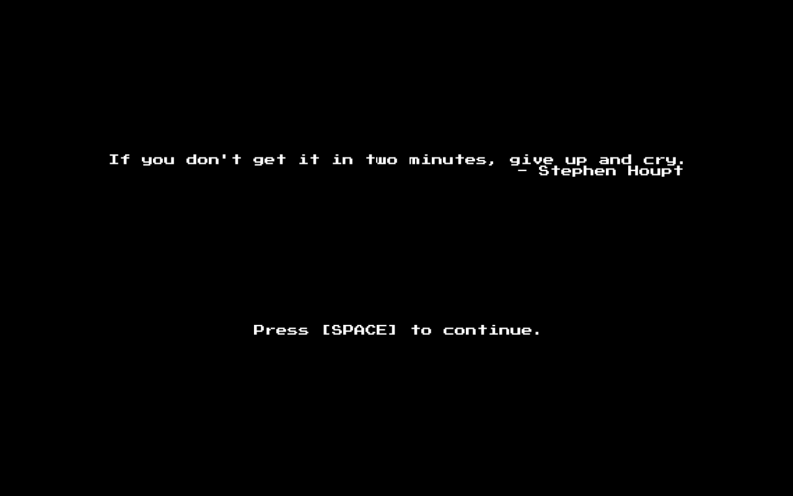

# SMasteroids

 

> A game in honor of the St. Mark's science faculty and the Winn Science Building.

## Playing the Game

You can obtain pre-built releases of the game from the [Releases](https://github.com/20zinnm/smasteroids/releases) page. These are generally more reliable than development builds.

If your platform is not already included, you may also compile the program yourself using a standard Go toolchain with CGO enabled.

## Built With

* [faiface/pixel](https://github.com/faiface/pixel) -- seriously, an incredible game library.
* Blood, sweat, and tears.

## Versioning

We use [SemVer](http://semver.org/) for versioning. For the versions available, see the tags on this repository.

## Authors

* Meyer Zinn - _project lead_ - Junior, St. Mark's

## License

This project is licensed under the GPLv3 License - see the LICENSE.md file for details

## Acknowledgements

* Faraz Asim - _playtester_ - Junior, St. Mark's
* Doug Rummel, who put up with this during Information Engineering.
* Fletcher Carron, who humored me by putting the game on the big screen in the Winn Science Center.

This game is meant to honor the science faculty in a humorous way. Quotes may be altered or fabricated for comedic purposes.